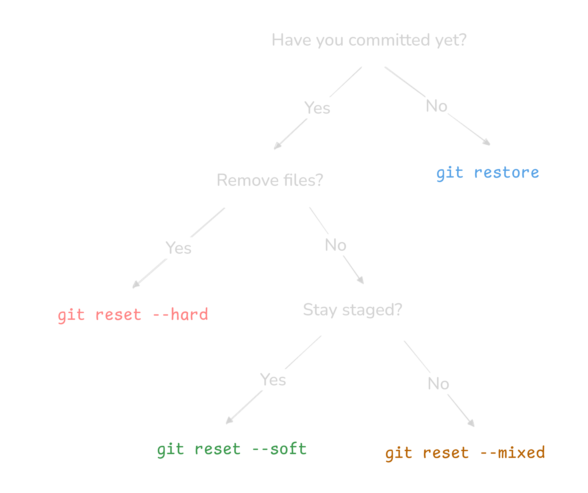

## `git restore`

Use when file is modified but not committed, Restores last committed version, Affects working directory only



```sh
git restore file.txt #sepcific file
git restore . # all
```

<br>

## `git reset`



`git reset` use to undo commits. Can affect staging area and working directory depending on mode.

- mixed – resets staging area, keeps working directory
- soft – moves HEAD only, keeps staged and working changes
- hard – resets everything including working directory

```sh
git reset <mode> <commit>
git reset --mixed HEAD~1
git reset --soft HEAD~1
git reset --hard HEAD~1
```

<br>

> `restore` = undo FILE changes
> `reset` = undo COMMITS

**Check the tour**

```
git reflog
```

<!-- like to test it out  -->

<br>


